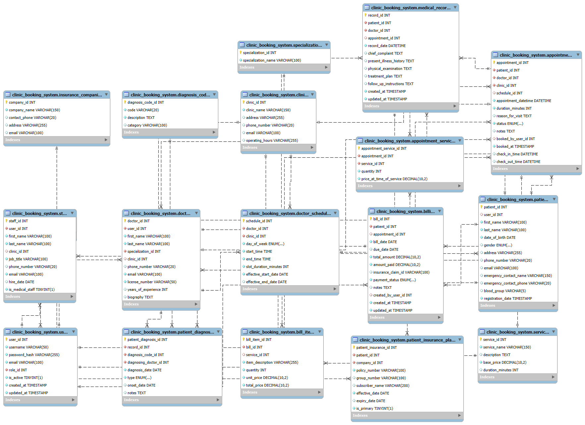

# Clinic Booking System Database

## Description

This project provides the SQL schema for a clinic booking system database. It defines tables and relationships for managing users, roles, doctors, staff, patients, clinics, appointments, services, insurance, billing, and medical records. The schema is designed to support a comprehensive clinic management workflow, including appointment scheduling, patient records, billing, and insurance handling.

## Setup Instructions

1. Ensure you have a MySQL or compatible database server installed.
2. Create a new database (or use an existing one).
3. Import the provided SQL file (`clinic_booking_system`) into your database using a tool like MySQL Workbench or the command line:

   ```sh
   mysql -u your_username -p your_database_name < clinic_booking_system
   ```

4. The tables and relationships will be created as defined in the SQL file.

## Entity-Relationship Diagram

